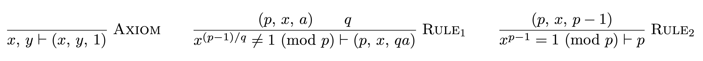

# prime-certify

[Pratt primality certificates](http://boole.stanford.edu/pub/SucCert.pdf)
in Haskell, implemented as an [LCF](https://en.wikipedia.org/wiki/Logic_for_Computable_Functions)-style proof system.

The result is that we have a type `Prime` which has constructors hidden at the
module level. The only way to obtain a value of type `Prime` outside of this
module is to provide a proof using the system presented in the paper. As primality
testing is deterministic, we can automatically generate such proofs.

For examples, see [`Examples.hs`](src/Examples.hs).

The library also allows the derivation of a proof to be writen to a [TeX](https://www.latex-project.org/) file.
See [here](resources/7.pdf) for an example derivation PDF, showing that 7 is prime.

## References

1. Vaughan Pratt, [*Every Prime has a Succint Certificate*](http://boole.stanford.edu/pub/SucCert.pdf)
2. Wikipedia, [*Primality certificate*](https://en.wikipedia.org/wiki/Primality_certificate)
